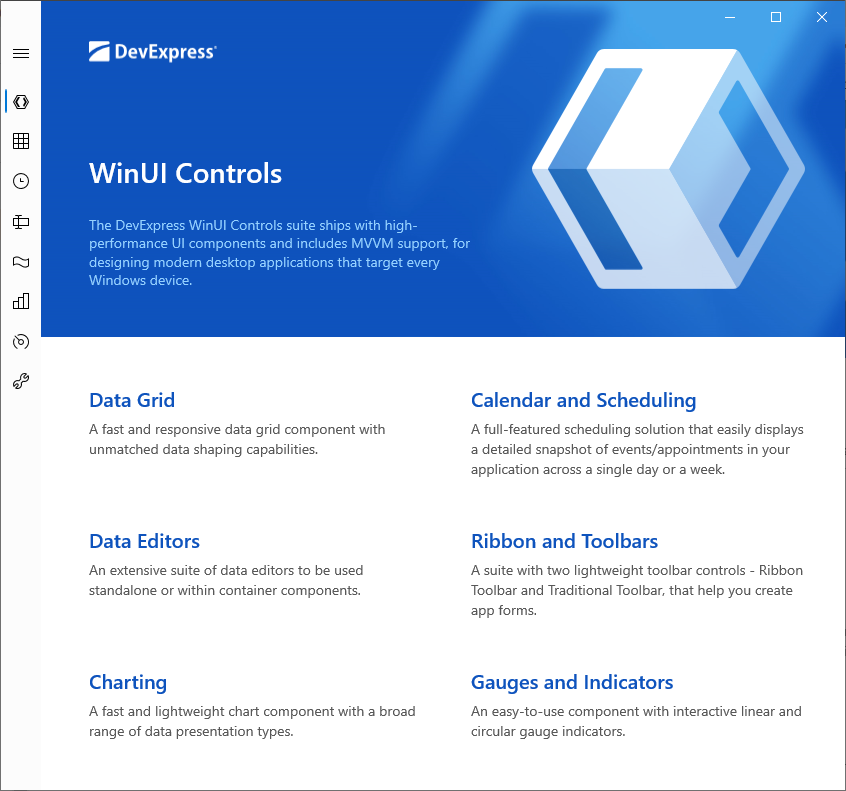
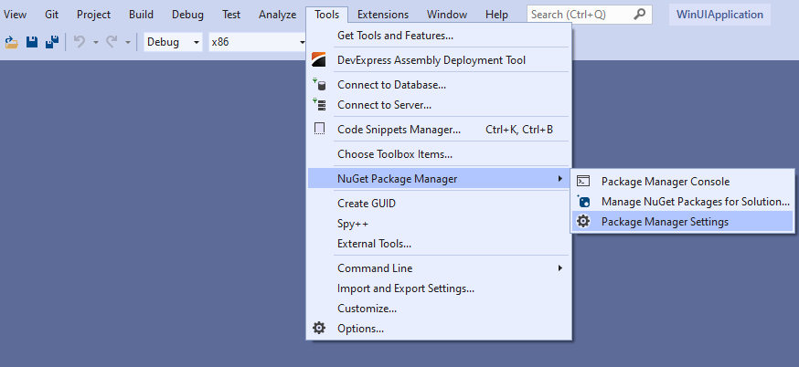
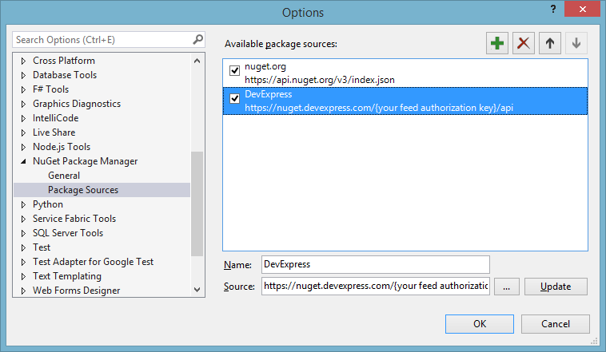

# DevExpress WinUI 3 Demos

This repository contains WinUI 3 demos that show how to use [DevExpress WinUI components](https://devexpress.com/winui/) and tools, including the Data Grid, Scheduler, Charting, and Data Editors.

## System Requirements

* Windows 10, version 1809 (build 17763), or newer installed
* Visual Studio 2019 version 16.9 or higher, or Visual Studio 2019 Preview version 16.10 or higher
* .NET Desktop development workload for Visual Studio

For more information, refer to [Windows App SDK](https://docs.microsoft.com/en-us/windows/apps/windows-app-sdk/).

## Run Demos

1. Open the demo project.

2. Use your DevExpress credentials to log into [devexpress.com](https://devexpress.com/). Refer to the [devexpress.com/winui-free](https://devexpress.com/winui-free) page to get your DevExpress WinUI Controls license. Check the specified email address and copy the [NuGet feed URL](xref:116042) from the email to the clipboard.

3. In Visual Studio, select **Tools -> NuGet Package Manager -> Package Manager Settings**.

    

4. Navigate to **NuGet Package Manager -> Package Sources**. Click the plus sign at the top right corner to add a new NuGet package source. Use the following package settings:

    * Name - **DevExpress**

    * Source - the obtained NuGet Feed URL (`https://nuget.devexpress.com/{your feed authorization key}/api`)

    Make sure the **nuget.org** package source is also enabled. Click **OK**.
    
    

5. Build the demo project. All the required NuGet packages will be automatically retrieved by Visual Studio.

    If you cannot build the demo, check whether the correct configuration is specified (x86 or x64). Then execute **Rebuild Solution**.

## Demos Application

[DevExpress WinUI Demos App](https://demos.devexpress.com/winui/)

## Documentation

[DevExpress WinUI Controls](https://docs.devexpress.com/WinUI/402541/winui-controls)

## Feedback

Your input can help us shape future product offerings for WinUI. Feel free to contact us at wpfteam@devexpress.com.

## Copyright

Developer Express Inc. All rights reserved.
